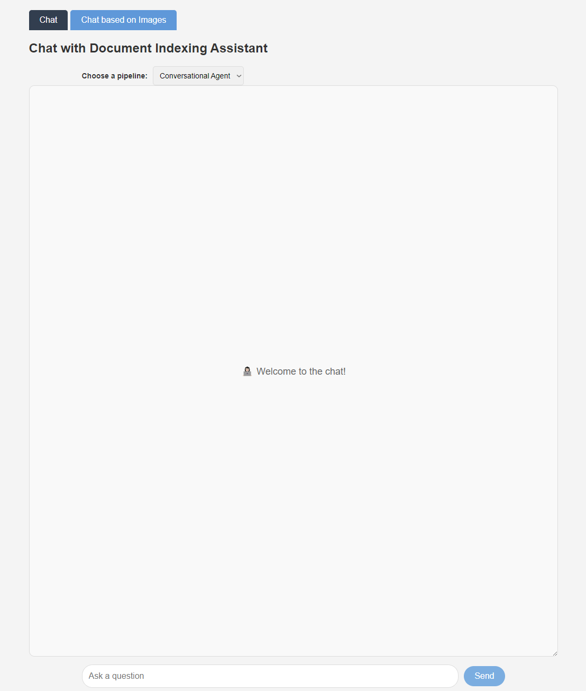

# A-Multimodal-Framework-Embedding-Retrieval-Augmented-Generation-with-MLLMs-for-Eurobarometer-Data

This repository has been established in conjunction with the publication of the research paper titled [A Multimodal Framework Embedding Retrieval-Augmented Generation with MLLMs for Eurobarometer Data](https://www.mdpi.com/2673-2688/6/3/50) and serves as a supplementary resource for researchers interested in creating Multi-Agent systems integrated with MLLMs. Our example use case is dedicated to E-Government Services.

### Citation
```bibtex
@Article{ai6030050,
AUTHOR = {Papageorgiou, George and Sarlis, Vangelis and Maragoudakis, Manolis and Tjortjis, Christos},
TITLE = {A Multimodal Framework Embedding Retrieval-Augmented Generation with MLLMs for Eurobarometer Data},
JOURNAL = {AI},
VOLUME = {6},
YEAR = {2025},
NUMBER = {3},
ARTICLE-NUMBER = {50},
URL = {https://www.mdpi.com/2673-2688/6/3/50},
ISSN = {2673-2688},
ABSTRACT = {This study introduces a multimodal framework integrating retrieval-augmented generation (RAG) with multimodal large language models (MLLMs) to enhance the accessibility, interpretability, and analysis of Eurobarometer survey data. Traditional approaches often struggle with the diverse formats and large-scale nature of these datasets, which include textual and visual elements. The proposed framework leverages multimodal indexing and targeted retrieval to enable focused queries, trend analysis, and visualization, across multiple survey editions. The integration of LLMs facilitates advanced synthesis of insights, providing a more comprehensive understanding of public opinion trends. The proposed framework offers prospective benefits for different types of stakeholders, including policymakers, journalists, nongovernmental organizations (NGOs), researchers, and citizens, while highlighting the need for performance assessment to evaluate its effectiveness based on specific business requirements and practical applications. The framework’s modular design supports applications, such as survey studies, comparative analyses, and domain-specific investigations, while its scalability and reproducibility make it suitable for e-governance and public sector deployment. The results indicate potential enhancements in data interpretation and data analysis by providing stakeholders with the capability not only to utilize raw text data for knowledge extraction but also to conduct image analysis based on indexed content, paving the way for informed policymaking and advanced research in the social sciences, while emphasizing the need for performance assessment to validate the framework’s output and functionality, based on the selected architectural components. Future research will explore expanded functionalities and real-time applications, ensuring the framework remains adaptable to evolving needs in public opinion analysis and multimodal data integration.},
DOI = {10.3390/ai6030050}
}
```

## Introduction

The repository contains a [FastAPI](https://github.com/fastapi/fastapi) application designed to run in Google Colab. It is built using the robust open-source [Haystack](https://github.com/deepset-ai/haystack) framework, which provides an end-to-end solution for Large Language Models (LLMs) and Multimodal Large Language Models (MLLMs).

The application offers a web-based interface for interacting with Generative AI models such as GPT-4o-mini and GPT-4o, allowing for modular selection of models on the framework's backend. It supports three modes for processing questions and answers, including dedicated Retrieval-Augmented Generation (RAG) pipelines for text and image-related data, along with Conversational Multi-Agent systems. The main functionalities include engaging in interactive conversations with the Gen AI models of their choice upon configuration and conversational agents based on text and image-related data, with the option for analyzing images in QA.


## Example Use Case

The use case presented in our research focuses on enhancing E-Government Services through a state-of-the-art, modular, and reproducible architecture utilizing LLMs and MLLMs.

In our example, we use the publicly available source, the [Eurobarometer](https://europa.eu/eurobarometer/screen/home). The data used complies with the terms of use policy, and all appropriate credit goes to the Eurobarometer. Please note that this repository is not affiliated with, sponsored by, or endorsed by the Eurobarometer.

Our approach emphasizes modularity and reproducibility, with all pipelines and setups designed to be flexible and customizable. Users can apply different AI models, utilize different vectorized databases, integrate MLLMs of their choice, implement various preprocessing steps based on requirements, deploy agents, and define their own data sources.


## Access Instructions

To access the notebook in Google Colab, click the badge below and follow the guidelines:

[](https://colab.research.google.com/github/gpapageorgiouedu/A-Multimodal-Framework-Embedding-Retrieval-Augmented-Generation-with-MLLMs-for-Eurobarometer-Data/blob/main/RAG_MLLMs_demo.ipynb)

Example indexing and querying pipelines are set up as demonstrated in our research. For usage, you will need to create your own index. All components are modular and scalable, allowing a variety of vectorized databases, generative AI models and MLLMs, embeddings, prompts, and other elements to be modified as per users' preferences.


## Features

- **File Upload and Indexing**: Supports indexing plain text and files in various formats (text, PDF, Word) for efficient retrieval.
- **Dynamic Conversation Interface**: Provides a web-based chat interface for interacting with Gen AI models in real-time integrated with MLLMs.
- **Multiple Processing Modes**: Allows selection of different processing modes and models to customize how questions are handled and answered.
- **Prompts configuration**: Specialized pipelines for handling specific types of queries and data related to E-Government Services.
- **Conversational Mode**: Enables dynamic conversations with the Gen AI models and multiple tools, retaining context and history.
- **Chat Based on Images**: Leverages images-related RAG for retrieving images based on an initial query and enables the image analysis for querying with attached related images.


## Web UI example



## Repository Contents

This repository contains the following structure:

- **`RAG_MLLMs_demo.ipynb`**: The Jupyter Notebook is usable from Google Colab and contains the main code and demonstrations for using the application with documentation.

- **`templates/`**: This directory contains HTML templates used by the FastAPI application to render web pages.

- **`static/`**: This folder includes static files such as CSS that are used in the web interface.

- **`images/`**: This directory contains the image used in the README.

## Compliance with AI EU Act

This project is designed with compliance in mind regarding the [European Union's AI Act](https://www.europarl.europa.eu/topics/en/article/20230601STO93804/eu-ai-act-first-regulation-on-artificial-intelligence), [European Union's AI Act](https://digital-strategy.ec.europa.eu/en/policies/regulatory-framework-ai), both for current use and for future updates as the regulatory landscape evolves. Users who deploy, modify, or extend this application should be aware of the AI EU Act's guidelines and ensure compliance with applicable regulations.
